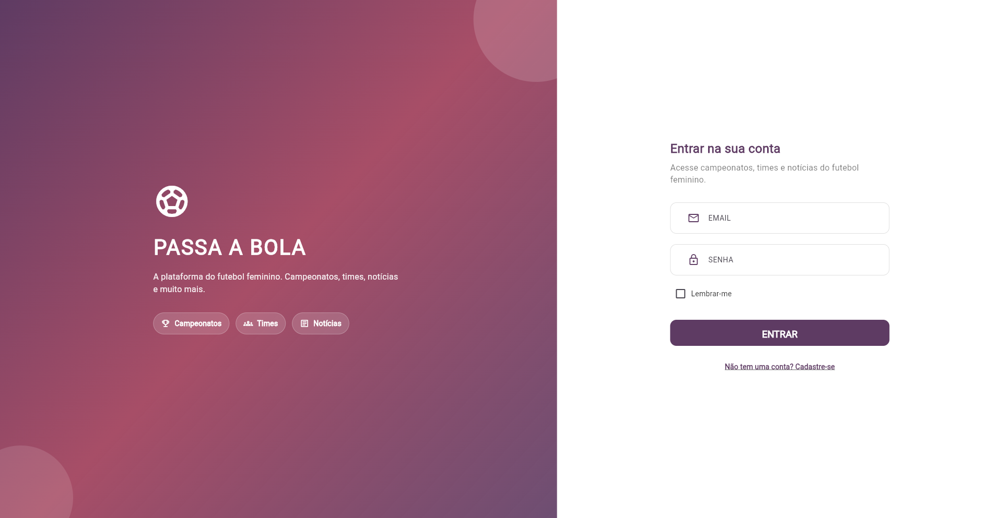
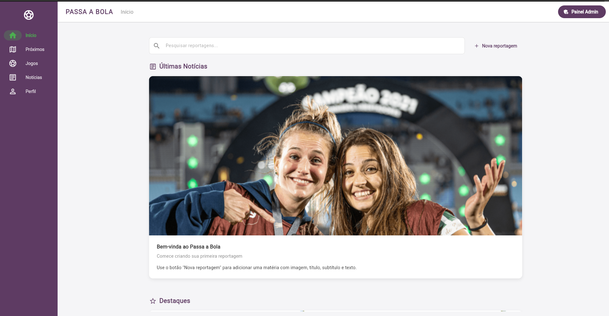
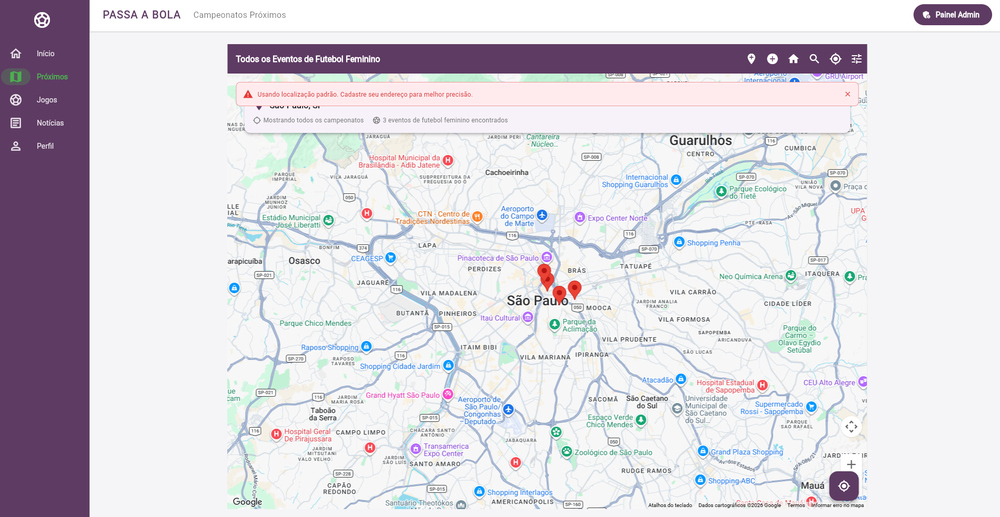
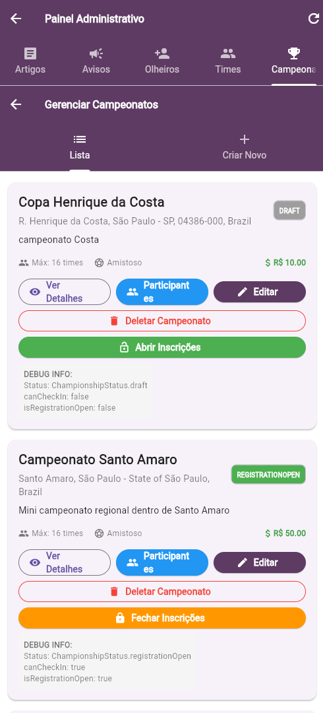

# Passa a Bola

<p align="center">
  <strong>Plataforma web e mobile criada para fortalecer o ecossistema do futebol feminino.</strong>
</p>

<p align="center">
  <a href="https://flutter-app-f547b.web.app/">Acessar demonstração</a> ·
  <a href="#como-executar">Executar localmente</a> ·
  <a href="#minha-contribuição--gabriel-sakura">Minha contribuição</a>
</p>

<p align="center">
  
  
  
  
</p>

## Sobre o projeto

O futebol feminino ainda enfrenta pouca centralização de informações sobre atletas, clubes, campeonatos e oportunidades. O **Passa a Bola** reúne esses públicos em uma plataforma responsiva, com recursos para organização de times e competições, descoberta de talentos e acompanhamento de conteúdo esportivo.

O projeto foi desenvolvido por uma equipe de cinco estudantes de Engenharia de Software da FIAP e percorreu o ciclo completo de produto: pesquisa de mercado, definição do problema, prototipação, implementação e integração de serviços.

## Minha contribuição — Gabriel Sakura

Atuei de ponta a ponta no projeto, com responsabilidade por:

- pesquisa de mercado e levantamento do problema;
- idealização do produto e definição da experiência do usuário;
- coleta e preparação inicial de dados por meio de *web scraping*;
- design das interfaces web e mobile;
- implementação das telas e integração entre aplicação, Firebase e serviços externos;
- colaboração técnica e organização das entregas em uma equipe de cinco pessoas.

Além do resultado técnico, o projeto fortaleceu minha autonomia, capacidade de priorização e comunicação para manter as entregas avançando mesmo com diferentes níveis de disponibilidade dentro da equipe.

## Funcionalidades

- autenticação e cadastro com diferentes perfis de acesso;
- feed de notícias, artigos e anúncios;
- criação, consulta e gerenciamento de times;
- campeonatos com inscrição, participantes, localização e *check-in*;
- mapas e busca de campeonatos próximos à pessoa usuária;
- solicitações e marcadores para observação de atletas por olheiros;
- consulta de times, partidas e jogadoras por API esportiva;
- áreas administrativas para conteúdo, equipes e campeonatos;
- interface responsiva para web e dispositivos móveis.

## Arquitetura e tecnologias

```text
Flutter (web/mobile)
    ├── Firebase Authentication
    ├── Cloud Firestore / Firebase Storage / Data Connect
    ├── Google Maps e geolocalização
    └── API-Sports
```

| Camada | Tecnologias |
| --- | --- |
| Interface | Flutter, Dart, Material Design |
| Autenticação e dados | Firebase Auth, Cloud Firestore, Firebase Storage, Data Connect |
| Mapas e localização | Google Maps, Geolocator, Geocoding |
| Integrações | HTTP, API-Sports, YouTube Player |
| Qualidade e entrega | Git, GitHub, Flutter Analyze, Firebase Hosting |

## Demonstração

| Login responsivo | Área principal |
| --- | --- |
|  |  |

| Campeonatos no mapa | Administração mobile |
| --- | --- |
|  |  |

> As imagens representam a versão acadêmica atual. Novas capturas podem ser adicionadas em `web/assets/` conforme a interface evoluir.

## Como executar

### Pré-requisitos

- [Flutter SDK](https://docs.flutter.dev/get-started/install) compatível com Dart `^3.8.0`;
- projeto configurado no Firebase;
- chaves próprias do Google Maps e, opcionalmente, da API-Sports.

### Instalação no Windows

```powershell
git clone https://github.com/gabsakura/passa-a-bola.git
cd passa-a-bola
flutter pub get
Copy-Item .env.example .env
```

Preencha o arquivo `.env` com as credenciais dos seus próprios serviços e execute:

```powershell
.\scripts\run_local.ps1
```

O script transforma as variáveis locais em `env.json`, prepara as configurações nativas do Google Maps e inicia o Flutter com `--dart-define-from-file`. Para escolher um dispositivo:

```powershell
.\scripts\run_local.ps1 -Device chrome
```

Nunca envie `.env`, `env.json` ou chaves privadas para o GitHub. O arquivo `.env.example` contém apenas os nomes esperados das variáveis.

## Estrutura principal

```text
lib/
├── config/       # variáveis de ambiente e configurações
├── data/         # autenticação, constantes e acesso a dados
├── models/       # modelos da aplicação
├── pages/        # telas públicas, de usuário e administrativas
├── services/     # localização, endereços, CEP e olheiros
└── widgets/      # componentes reutilizáveis
scripts/          # preparação de ambiente, execução e deploy
web/assets/       # imagens usadas na demonstração
dataconnect/      # esquema e configuração do Firebase Data Connect
```

## Verificação antes de contribuir

```bash
flutter pub get
dart format --output=none --set-exit-if-changed lib
flutter analyze
```

## Equipe

- Caio Nascimento Caminha
- **Gabriel Alexandre Fukushima Sakura**
- Gabriel Oliveira Amaral
- Lucas Henrique Viana Estevam Sena
- Rafael Tavares Santos

Projeto acadêmico desenvolvido na FIAP. O repositório ainda não possui uma licença de uso definida.
